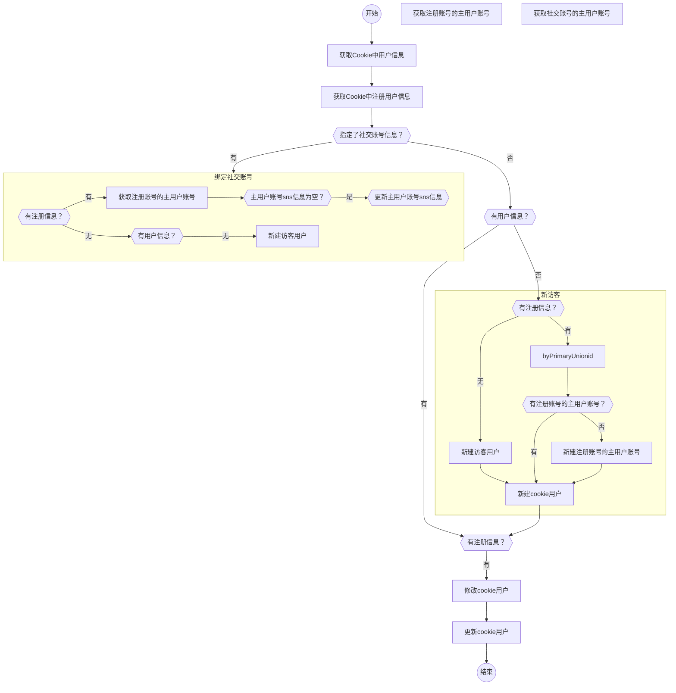

获取当前用户信息的流程

用户信息加密保存在`xxt_site_团队ID_fe_user`中。
用户注册信息加密保存在`xxt_site_user_login`中。

cookieUser
xxt_site_account

| 属性        |     |     |     |
| ----------- | --- | --- | --- |
| uid         |     |     |     |
| nickname    |     |     |     |
| expire      |     |     |     |
| unionid     |     |     |     |
| loginExpire |     |     |     |
