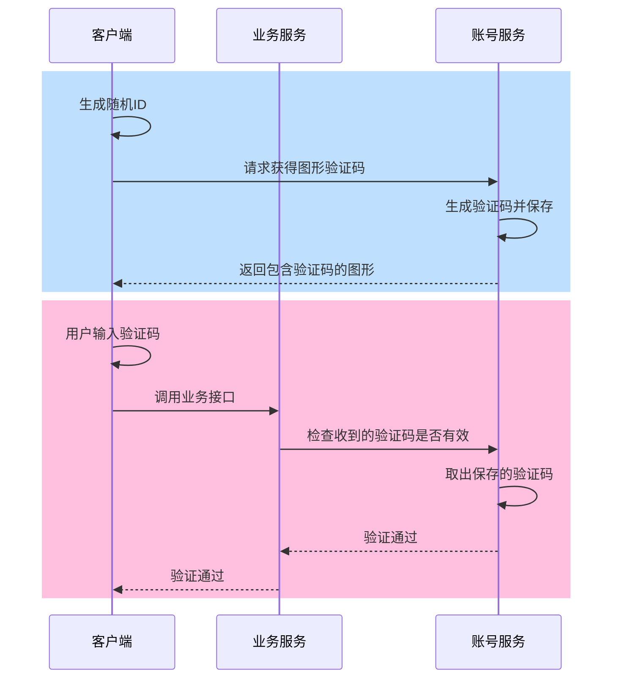
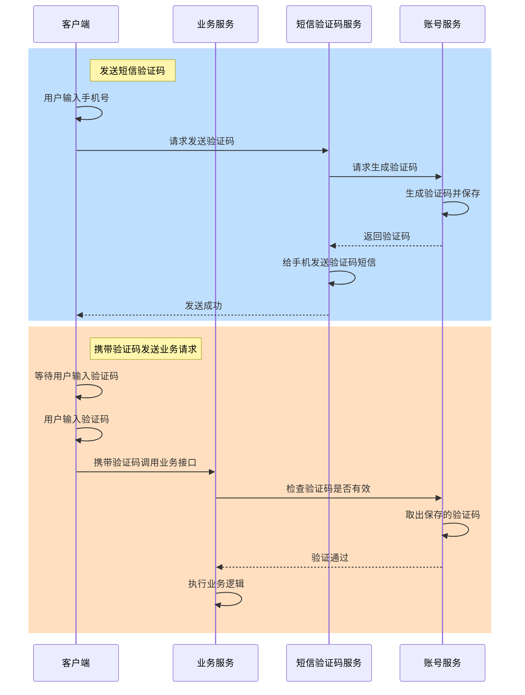

# 图形验证码调用业务接口

```mermaid
sequenceDiagram
participant UE as 客户端
participant App as 业务服务
participant Acct as 账号服务

rect rgb(191, 223, 255)
UE->>UE: 生成随机ID
UE->>Acct: 请求获得图形验证码
Acct->>Acct: 生成验证码并保存
Acct-->>UE: 返回包含验证码的图形
end
rect rgb(255,191, 223)
UE->>UE: 用户输入验证码
UE->>App: 调用业务接口
App->>Acct: 检查收到的验证码是否有效
Acct->>Acct: 取出保存的验证码
Acct-->>App: 验证通过
App-->>UE: 验证通过
end

```

# 短信验证码调用业务接口

```mermaid
sequenceDiagram
participant UE as 客户端
participant App as 业务服务
participant Sms as 短信验证码服务
participant Acct as 账号服务

rect rgb(191, 223, 255)
note right of UE: 发送短信验证码
UE->>UE: 用户输入手机号
UE->>Sms: 请求发送验证码
Sms->>Acct: 请求生成验证码
Acct->>Acct: 生成验证码并保存
Acct-->>Sms: 返回验证码
Sms->>Sms: 给手机发送验证码短信
Sms-->>UE: 发送成功
end
rect rgb(255, 223,191)
note right of UE: 携带验证码发送业务请求
UE->>UE: 等待用户输入验证码
UE->>UE: 用户输入验证码
UE->>App: 携带验证码调用业务接口
App->>Acct: 检查验证码是否有效
Acct->>Acct: 取出保存的验证码
Acct-->>App: 验证通过
App->>App: 执行业务逻辑
end

```

# 实现说明

账号服务提供接口给业务服务调用。账号服务提供生成和检查验证码的接口。生成接口支持返回字符串或图形格式的验证码。

申请验证码时需提供`appId`和`captchaId`标识验证码。账号服务不对这两个参数的含义和格式负责，由调用方自己保证唯一性和业务含义。

验证码支持有效期。
